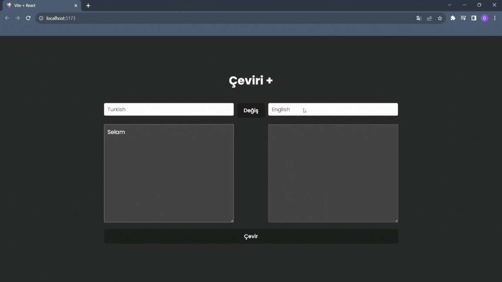

# Translate App

- This web application is a tool you can use to translate texts from one language to another. It was developed using Redux Toolkit and Thunk.

## Sources

- Rapid API:https://rapidapi.com/dickyagustin/api/text-translator2

## Libraries Used

- react-select

- redux-toolkit

- redux-toolkit-thunk

## Gif

